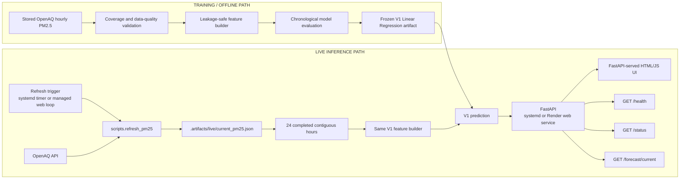

# AirAware VN

AirAware VN is an end-to-end PM2.5 forecasting system for Hanoi. It ingests real hourly observations from OpenAQ, validates temporal and data-quality semantics, builds leakage-safe historical features, and serves a six-hour-ahead forecast through FastAPI and a minimal web interface.

The project demonstrates more than model fitting: it connects reproducible offline evaluation to fresh-data inference, explicit freshness and gap handling, operational status reporting, and local service automation.

## What users see

The web application displays:

- latest completed hourly PM2.5 measurement;
- predicted PM2.5 six hours ahead;
- prediction and target intervals;
- fresh, stale, unavailable, or explicitly historical data state;
- model and operational status.

The current forecast never silently falls back to historical data. Historical output remains available as a clearly labeled offline fallback when its separate frozen input artifact is provisioned; a fresh Render clone does not include that ignored artifact.

> **Public demo:** a temporary Cloudflare Quick Tunnel may be available during active development. Its random URL is not permanent hosting; stable deployment is planned.

## Architecture

AirAware has separate offline training and live inference paths. The hourly refresh updates data only—it does not retrain or modify the frozen model.



## Data and prediction target

V1 uses hourly PM2.5 means from the configured OpenAQ sensor in Hanoi. Each normalized record preserves sensor identity, event time, provider interval end, value, unit, and source record ID. The live artifact adds an ingestion timestamp to each row, while retrieval time, request metadata, raw payload paths, and payload hashes are stored at artifact/request-provenance level.

The model predicts PM2.5 **six hours ahead**. If `event_time = t` identifies the completed interval `[t, t+1h)`, then at prediction time `t` the latest safe source interval has `event_time = t-1h`. Consequently, `pm25_lag_1h` is the latest safely completed measurement—not the raw PM2.5 value at the prediction row.

Live inference requires exactly 24 contiguous completed hourly intervals. It rejects missing or conflicting hours and never interpolates PM2.5.

## Leakage-safe V1 features

The frozen V1 feature contract contains:

| PM2.5 history | Calendar context (Asia/Ho_Chi_Minh) |
|---|---|
| `pm25_lag_1h` | `hour` |
| `pm25_lag_2h` | `day_of_week` |
| `pm25_lag_3h` | `month` |
| `pm25_lag_4h` | `is_weekend` |
| `pm25_lag_6h` | |
| `pm25_lag_8h` | |
| `pm25_lag_12h` | |
| `pm25_lag_18h` | |
| `pm25_lag_24h` | |
| `pm25_rolling_mean_6h` | |
| `pm25_rolling_mean_12h` | |
| `pm25_rolling_mean_24h` | |

Leakage controls include:

- lag features use positive shifts;
- rolling means first shift PM2.5 by one hour, then aggregate;
- raw row-`t` PM2.5 is excluded from the feature contract;
- weather is excluded from V1;
- train, validation, and test partitions are chronological and never shuffled;
- runtime inference constructs a synthetic prediction row with no PM2.5 value and reuses the training feature builder.

## Modeling and evaluation

Frozen V1 model and feature selection used expanding-window monthly walk-forward validation. August 2025 through January 2026 formed the initial history; February through June 2026 supplied 3,056 out-of-fold validation predictions. Every fold purged training rows unless their `t+6h` target timestamp was strictly earlier than the validation month start. July 2026 remained untouched until the model and A2 feature configuration were frozen.

| Validation model | Pooled MAE | Pooled RMSE |
|---|---:|---:|
| Persistence baseline | 11.3073 | 16.1619 |
| A2 LinearRegression | **9.8558** | **14.0273** |

The final July 2026 test used 613 shared timestamps. The frozen A2 LinearRegression fit on 6,711 eligible pre-July rows achieved MAE **8.265** and RMSE **10.468**, versus persistence MAE **9.840** and RMSE **12.530**. This is a **16.01%** MAE improvement and **16.46%** RMSE improvement. These final-test results were not used for further selection or tuning. After final evaluation, the unchanged A2 + LinearRegression specification was retrained on all 7,330 eligible rows for the production artifact; the reported July metrics belong to the pre-July fit, not that post-test artifact.

### Error analysis

V1 still underpredicts high pollution. On July observations above `35 µg/m³` (`n=91`), signed bias was approximately `-8.427 µg/m³` and underprediction rate was `81.32%`. July contained no observations above `75 µg/m³`, so the validation-era extreme-pollution limitation remains unresolved and is a V2 research question rather than a reason to alter frozen V1.

## Why weather is excluded from V1

The historical Open-Meteo artifact preserved valid-time weather, but not the forecast issue time, model run, or vintage metadata needed to prove that each value was available at the corresponding prediction time. Using those rows as if they were production forecast snapshots would risk point-in-time leakage and offline/online skew.

V1 therefore excludes weather by design. A weather-enabled V2 should ingest production-equivalent forecast snapshots with retrieval and issue timestamps before those features enter training or inference.

## Fresh inference and API

For local user-level systemd deployment, the hourly refresh path is:

```text
airaware-refresh.timer
  → airaware-refresh.service
  → python -m scripts.refresh_pm25
  → .artifacts/live/current_pm25.json
```

The API loads the saved V1 model once at startup. `/forecast/current` reads the latest local artifact, resolves duplicate-hour semantics, rejects incomplete intervals and gaps, builds the same V1 features, and returns the six-hour forecast. Data older than the centralized four-hour threshold is explicitly marked stale.

| Endpoint | Purpose |
|---|---|
| `GET /` | Web interface |
| `GET /health` | Cheap API/model liveness check |
| `GET /status` | Model, artifact, freshness, and current-forecast state |
| `GET /forecast/current` | Fresh or explicitly stale OpenAQ-based forecast |
| `GET /forecast/latest` | Historical/offline fallback; returns 503 unless its separate frozen artifact is provisioned |
| `POST /predict` | Low-level prediction contract for exactly 24 hourly observations |

## Run locally

### 1. Install

```bash
git clone https://github.com/mainamkhanh23102005/airawarevn.git airaware-vn
cd airaware-vn
python -m venv .venv
source .venv/bin/activate
pip install -r requirements-stage0.txt
```

Model and historical artifacts are intentionally stored under ignored `.artifacts/` paths. A working deployment needs the saved V1 model artifact expected by `app.main`, or an `AIRAWARE_MODEL_PATH` override. The repository now includes a supported offline training CLI that trains an artifact conforming to the frozen V1 contract from a frozen OpenAQ normalized PM2.5 artifact:

```bash
python -m scripts.modeling.train_cli --help
python -m scripts.modeling.train_cli \
  --input .artifacts/data_spike/coverage/openaq_normalized_sensor_13502151_20250731T170000+0000.json \
  --output .artifacts/models/airaware_v1.joblib
```

The CLI uses the same V1 feature builder, target, and `LinearRegression` contract as the API, and it refuses to overwrite an existing output unless `--force` is passed. The frozen OpenAQ normalized artifact is a prerequisite; it is not committed and must be produced by the data-spike workflow or supplied as an override.

### 2. Configure OpenAQ securely

Create a user-owned environment file; never place the real key in the repository:

```bash
mkdir -p ~/.config/airaware
chmod 700 ~/.config/airaware
${EDITOR:-vi} ~/.config/airaware/airaware.env
chmod 600 ~/.config/airaware/airaware.env
```

File contents:

```text
OPENAQ_API_KEY=replace-with-your-key
```

For a manual shell refresh, export the same variable without passing it as a command argument, then use module execution:

```bash
set -a
source ~/.config/airaware/airaware.env
set +a
python -m scripts.refresh_pm25
```

Do not invoke `python scripts/refresh_pm25.py`; repository package imports require module execution from the repository root.

### 3. Start the API manually

```bash
python -m uvicorn app.main:app --host 127.0.0.1 --port 8000
```

Open <http://127.0.0.1:8000>.

## Render deployment

`render.yaml` runs one Uvicorn web service on Render's `PORT` and binds to `0.0.0.0`. `scripts.start_render` provisions both trusted production model artifacts before startup: V1 through `AIRAWARE_MODEL_URL` / `AIRAWARE_MODEL_SHA256`, and the trajectory bundle through `AIRAWARE_MULTI_HORIZON_MODEL_URL` / `AIRAWARE_MULTI_HORIZON_MODEL_SHA256`. Each download uses a 30-second timeout, a 50 MiB limit, SHA-256 verification, and atomic replacement before its path is exported to the app.

Render uses the libsql forecast-store backend with the production Turso URL. `AIRAWARE_FORECAST_LEDGER_PATH` remains set as the app-level store activation switch; libsql ignores its local path value and connects through `AIRAWARE_TURSO_DATABASE_URL`. Configure `AIRAWARE_TURSO_AUTH_TOKEN` and `OPENAQ_API_KEY` as Render secrets; never put either credential in repository configuration.

A fresh clone cannot build the production models: saved model artifacts and frozen training input are intentionally ignored. Train offline with the same scikit-learn version used for serving, publish immutable V1 and multi-horizon artifacts to trusted storage, and configure each URL and SHA-256. Render startup never fabricates or retrains models. `/forecast/latest` additionally needs the ignored frozen normalized PM2.5 input supplied through `AIRAWARE_PM25_ARTIFACT_PATH`; without it, that optional historical endpoint returns 503.

Required Render variables:

```text
AIRAWARE_MODEL_URL=https://github.com/mainamkhanh23102005/airawarevn/releases/download/model-v1.1.0/airaware_v1.joblib
AIRAWARE_MODEL_SHA256=af27f76aca9dd637814f2a6c83d50ceb50fd1b7309762cfdf6898b2e94cb8605
AIRAWARE_MULTI_HORIZON_MODEL_URL=https://github.com/mainamkhanh23102005/airawarevn/releases/download/model-mh-v1.0.0/airaware-mh-v1.joblib
AIRAWARE_MULTI_HORIZON_MODEL_SHA256=8fb851e64ba51c010d6869ecc0180585f832dae9f65c884a7cc8c018e8b6e505
AIRAWARE_TURSO_DATABASE_URL=libsql://airaware-prod-mainamkhanh23102005.aws-ap-northeast-1.turso.io
AIRAWARE_TURSO_AUTH_TOKEN=<secret>
OPENAQ_API_KEY=<secret>
```

`AIRAWARE_TURSO_AUTH_TOKEN` and `OPENAQ_API_KEY` remain environment-only. `AIRAWARE_REFRESH_ENABLED=1` starts one bounded in-process refresh loop in web service: refresh runs immediately on startup and, while service remains active, hourly; failures preserve last good artifact and next scheduled attempt still runs. Render free spin-down suspends process and hourly cadence until next request wakes service. Keep one Uvicorn worker; multiple workers would duplicate OpenAQ requests. Current V1 live data is local JSON, so Render's ephemeral filesystem loses it on restart, causing immediate re-fetch, and separate Render cron services cannot share it with web service. Durable history or horizontal scaling requires shared object storage or database. Local systemd behavior remains unchanged because managed refresh is opt-in.

## Production monitoring scheduler

`.github/workflows/production-monitoring.yml` runs the production monitoring worker hourly at minute 15 on GitHub Actions and also supports manual `workflow_dispatch`. The production job is guarded to `refs/heads/main`, uses one concurrency group with `cancel-in-progress: false`, and never runs from `push` or `pull_request` events.

Configure these repository Actions secrets:

```text
OPENAQ_API_KEY=<secret>
AIRAWARE_TURSO_AUTH_TOKEN=<secret>
```

Each run checks out `main`, installs the Python 3.11 dependencies, downloads the canonical V1 artifact through `scripts.start_render.provision_model`, verifies SHA-256 `af27f76aca9dd637814f2a6c83d50ceb50fd1b7309762cfdf6898b2e94cb8605`, refreshes 72 hours of OpenAQ data for sensor `13502151` into `.artifacts/live`, then runs `python -m scripts.run_monitoring_cycle`. The worker uses the libsql backend and the production Turso URL; credentials stay in GitHub secrets.

GitHub Actions sets `AIRAWARE_MONITORING_LEASE_OWNER_ID=github-${{ github.run_id }}`. Manual reruns of one workflow run therefore reuse the same lease owner, while different workflow runs use different owners. CLI execution outside GitHub Actions generates a unique local owner. Existing `production-monitoring` lease TTL remains 3600 seconds and deterministic forecast, reconciliation, evaluation, and publication identities make duplicate or retried invocations safe.

Scheduled GitHub Actions execution is best-effort: a delayed or dropped schedule event is not backfilled. Model provisioning, OpenAQ refresh, or monitoring failures fail the job. Recovery is a manual workflow dispatch or rerun after the underlying issue is fixed.

## User-level systemd operation

Repository-managed templates live in `deploy/systemd/`. Install rendered user units with:

```bash
python -m scripts.install_systemd_user
systemctl --user daemon-reload
systemctl --user enable --now airaware-refresh.timer
systemctl --user enable --now airaware-monitoring.timer
systemctl --user enable --now airaware-api.service
```

Components:

- `airaware-refresh.timer`: persistent hourly schedule at approximately `HH:12`;
- `airaware-refresh.service`: oneshot data refresh with restricted write access to `.artifacts/live`;
- `airaware-monitoring.timer`: persistent hourly M1 issuance, M2 reconciliation, M3 materialization, and immutable snapshot cycle;
- `airaware-monitoring.service`: one oneshot worker. Set `AIRAWARE_FORECAST_LEDGER_PATH=.artifacts/ledger/forecasts.sqlite3` and `AIRAWARE_RECONCILIATION_RAW_DIRECTORY=.artifacts/reconciliation` in `~/.config/airaware/airaware.env`; it alone writes ledger and raw evidence;
- `airaware-api.service`: Uvicorn without `--reload`, bound to `127.0.0.1:8000`, restarting on failure after five seconds.

This local user-systemd path needs no paid infrastructure. Keep one monitoring timer enabled: SQLite `BEGIN IMMEDIATE` and deterministic issuer/snapshot identities make retries safe while avoiding concurrent worker scheduling. Render stays web-only because ephemeral storage and isolated services cannot provide durable shared ledger semantics.

Useful checks:

```bash
systemctl --user status airaware-refresh.timer
systemctl --user status airaware-api.service
journalctl --user -u airaware-refresh.service
journalctl --user -u airaware-api.service
```

The timer refreshes data only. Model retraining is a separate offline workflow.

## Testing

```bash
python -m unittest discover -s tests
python -m compileall -q app scripts tests
```

The full portable test suite passes without network access. Canonical-data regression tests additionally run when the regenerated frozen PM2.5 artifact is present; the latest local canonical-artifact verification ran **159 tests**. External OpenAQ calls are mocked in unit tests.

## Repository structure

```text
app/                  FastAPI application and server-served HTML UI
scripts/              OpenAQ ingestion, refresh, data-quality, and setup tools
scripts/modeling/     Frozen V1 features, training, serialization, and prediction
experiments/          Reproducible dataset inspection, baselines, comparisons, and error analysis
tests/                Unit and API integration tests without Internet/systemd dependency
deploy/systemd/       User-level refresh timer/service and API service templates
```

## V1 limitations

- One configured Hanoi PM2.5 sensor; no multi-station or spatial context.
- One six-hour forecast horizon.
- No production-equivalent weather forecast features.
- Extreme PM2.5 spikes remain difficult and are systematically underpredicted.
- Live data uses a local JSON artifact rather than durable shared storage.
- The model does not retrain automatically.
- Cloudflare Quick Tunnel is temporary demo exposure, not permanent hosting or an SLA-backed deployment.

## V2 roadmap

- point-in-time-safe weather forecast snapshots with issue and retrieval timestamps;
- multi-station and spatial features;
- spike-aware features, objectives, and stronger nonlinear models;
- explicit retraining and model-promotion strategy;
- stable cloud deployment and CI/CD;
- richer monitoring, metrics, and UI diagnostics.
