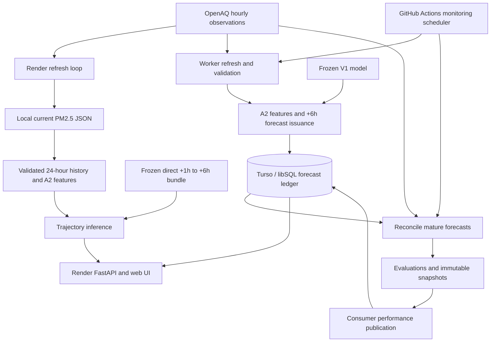

# AirAware VN

**An end-to-end PM2.5 forecasting system for Hanoi, from OpenAQ observations to monitored production forecasts.**

AirAware VN combines leakage-safe chronological evaluation, a FastAPI application, a six-point forecast trajectory, and durable forecast monitoring. The canonical +6h A2 LinearRegression reduced walk-forward MAE by **12.84% versus persistence** across **3,056 paired predictions**. Production configuration uses Render, Turso/libSQL, and a GitHub Actions monitoring scheduler.

[Technical portfolio and interview guide](docs/portfolio.md) · [Model results](#model-results) · [Local setup](#local-setup) · [Limitations](#limitations)

## Key capabilities

- Current PM2.5, +6h forecast, and independent direct forecasts for +1h through +6h.
- Vietnamese air-quality categories, recommendations, trend context, and explicit freshness/unavailability states.
- Expanding walk-forward evaluation with target-availability boundaries and a persistence baseline.
- Immutable forecast identities, durable Turso/libSQL ledger, observation reconciliation, and evaluation snapshots.
- Consumer-facing performance reporting and scheduled monitoring independent of web traffic.
- Hash-checked model downloads for Render; no startup training or automatic model promotion.

## Architecture


```mermaid
flowchart TD
  OA[OpenAQ hourly observations] --> WEBREF[Render refresh loop]
  WEBREF --> LOCAL[Local current PM2.5 JSON]
  LOCAL --> FEATURES[Validated 24-hour history and A2 features]
  BUNDLE[Frozen direct +1h to +6h bundle] --> TRAJ[Trajectory inference]
  FEATURES --> TRAJ
  TRAJ --> API[Render FastAPI and web UI]
  GHA[GitHub Actions monitoring scheduler] --> REF[Worker refresh and validation]
  OA --> REF
  REF --> ISSUE[A2 features and +6h forecast issuance]
  V1[Frozen V1 model] --> ISSUE
  ISSUE --> DB[(Turso / libSQL forecast ledger)]
  GHA --> REC[Reconcile mature forecasts]
  OA --> REC
  DB --> REC
  REC --> EVAL[Evaluations and immutable snapshots]
  EVAL --> PUB[Consumer performance publication]
  PUB --> DB
  DB --> API
```

Offline training and evaluation are separate from both runtime paths. Refresh updates observations, not models. The scheduler has its own data artifact: it does not share Render's ephemeral filesystem. Turso stores forecasts and monitoring records, not the web runtime's current PM2.5 JSON.

## Modeling methodology

The A2 feature contract uses nine PM2.5 lags (1, 2, 3, 4, 6, 8, 12, 18, 24 hours), three shifted rolling means (6, 12, 24 hours), and four calendar features in `Asia/Ho_Chi_Minh`. LinearRegression provides a simple, inspectable starting point without unnecessary model complexity.

- **Chronological evaluation, never a random split:** initial history spans August 2025–January 2026; expanding monthly validation folds cover February–June 2026.
- **Strict boundaries:** a training target timestamp must precede the validation start. Features only use completed past intervals; rolling windows shift by one hour first.
- **Persistence:** predict the latest completed PM2.5 measurement, `pm25_lag_1h`. It is a meaningful competitor for an autocorrelated hourly series.
- **Paired comparisons:** models and persistence are scored on shared timestamps. M8 supports native and common cohorts, including matched training cohorts, so missing features cannot manufacture an improvement.
- **Direct multi-horizon forecasts:** six independently fitted LinearRegression models use the same A2 feature contract; predictions are not recursively fed into later horizons.
- **No fabricated observations:** missing hours remain missing; live inference requires 24 contiguous completed hourly intervals. Targets are matched by timestamp rather than row position.

For origin `t`, the latest safe source interval is `[t-1h, t)`. The +6h target is `[t+6h, t+7h)`. Historical archive ingestion availability cannot be reconstructed, so event-time safeguards do not prove historical provider delivery times. Six late-June validation targets cross into July; July is not described as entirely untouched label data.

Weather is excluded because historical weather lacks the issue-time/model-run/vintage evidence needed to establish prediction-time availability. See [feature construction](scripts/modeling/features.py), [backtest tests](tests/test_backtest.py), and [multi-horizon evaluation](scripts/modeling/multi_horizon.py).

## Model results

### Canonical +6h walk-forward validation

February–June 2026 pooled results, in µg/m³; bias is prediction minus observation. These exact values are preserved in [canonical regression assertions](tests/test_multi_horizon.py), which require the ignored frozen dataset to run.

| Model | MAE | RMSE | Bias | Count | MAE improvement vs persistence |
|---|---:|---:|---:|---:|---:|
| Persistence | 11.307251308900524 | 16.16191190424337 | +0.11611256544502616 | 3056 | 0% |
| A2 LinearRegression | 9.855844823038945 | 14.027286230773658 | +0.9370505512624444 | 3056 | **12.836068167328174%** |

Improvement is `100 × (persistence MAE − model MAE) / persistence MAE`. RMSE improves by **13.207754664899884%**; signed bias is not better than persistence.

**M8 selection outcome:** no tested richer feature set beat A2, so A2 remained selected. Added rolling variability and cyclical-hour features did not justify promotion. This is disciplined model selection, not a requirement to adopt a more complex model. The retained project outcome is recorded here; candidate score reports are not committed, so no candidate-level scores are claimed.

### Multi-horizon evidence

The application supports all six horizons, but this checkout does not contain the final +1h–+5h numeric report. Missing values below are intentionally not inferred from +6h; each horizon has its own eligible cohort.

| Horizon | ML MAE | ML RMSE | Bias | Persistence MAE | Improvement % | Count |
|---|---:|---:|---:|---:|---:|---:|
| +1h | Not recorded | Not recorded | Not recorded | Not recorded | Not recorded | Not recorded |
| +2h | Not recorded | Not recorded | Not recorded | Not recorded | Not recorded | Not recorded |
| +3h | Not recorded | Not recorded | Not recorded | Not recorded | Not recorded | Not recorded |
| +4h | Not recorded | Not recorded | Not recorded | Not recorded | Not recorded | Not recorded |
| +5h | Not recorded | Not recorded | Not recorded | Not recorded | Not recorded | Not recorded |
| +6h | 9.855844823038945 | 14.027286230773658 | +0.9370505512624444 | 11.307251308900524 | 12.836068167328174 | 3056 |

The +6h row is the canonical validation regression, not a separate final-test result. [Evaluation runner](scripts/modeling/multi_horizon.py) defines the all-horizon report; no new training or evaluation is needed merely to present existing evidence.

### Historical July test

Previously documented V1 results: **613 shared timestamps**, A2 MAE **8.265**, RMSE **10.468**, versus persistence **9.840** and **12.530**. Improvements from these rounded values are **16.01% MAE** and **16.46% RMSE**. The pre-July fit used **6,711 rows**; the later production fit used **7,330 eligible rows** with unchanged A2 specification. July scores belong to the pre-July fit, not the production artifact, and July is no longer a pristine holdout for new experiments.

On July observations above 35 µg/m³ (`n=91`), bias was approximately **−8.427 µg/m³**, with **81.32%** underprediction. No July observations exceeded 75 µg/m³. See [historical project record](docs/pre-m1-project-history.md).

### Canonical data provenance

Retained canonical project record (the ignored input and coverage report are not included in a fresh clone):

| Field | Value |
|---|---|
| OpenAQ sensor | `13502151` |
| Start, inclusive | `2025-07-31T17:00:00Z` |
| End, exclusive | `2026-07-31T17:00:00Z` |
| Valid PM2.5 hours | 8,339 / 8,760 expected, approximately 95.19% |
| Longest observed gap | 86 hours |
| Frozen input SHA-256 | `585d2068dc66d0f66ffbb9cb51d402b2e7cc5fe2ce59804e163f86d435235bc1` |

These are historical observation coverage figures, not feature-eligible prediction counts or deliberately sparse coverage-gate test fixtures. The digest is a retained identity, not a claim that this checkout reverified the absent file.

## Production architecture

[Render configuration](render.yaml) runs one Uvicorn web service on Python **3.14.4**. [Startup provisioning](scripts/start_render.py) downloads missing trusted artifacts with a 30-second timeout, 50 MiB limit, SHA-256 verification, and atomic replacement. Existing destination files bypass download verification; artifact locations must remain trusted. Startup does not retrain models.

| Artifact | Release | SHA-256 |
|---|---|---|
| V1 +6h | `model-v1.1.0` | `af27f76aca9dd637814f2a6c83d50ceb50fd1b7309762cfdf6898b2e94cb8605` |
| Direct trajectory bundle | `model-mh-v1.0.0` | `8fb851e64ba51c010d6869ecc0180585f832dae9f65c884a7cc8c018e8b6e505` |

Release tags are not API model identities: V1 reports `v1`; the bundle carries its own model-version metadata and format version 1. Download locations are maintained in `render.yaml`. The bundle records training Python 3.12.10 and scikit-learn 1.9.1; the prior compatibility check passed on serving Python 3.14.4. Other runtime combinations are not implied to be supported.

- **Web refresh:** immediate attempt at startup, then a one-hour wait after each attempt while the process remains active. Failures preserve the last good artifact. Free-service spin-down pauses the loop; one worker avoids duplicate refresh loops.
- **Durable ledger:** Render selects libSQL/Turso. `AIRAWARE_FORECAST_LEDGER_PATH` activates the app store even though the libSQL backend does not use that local path for persistence.
- **Separate read paths:** configured `/forecast/current` reads the latest issued ledger forecast. `/forecast/trajectory` and `/status` use Render-local observations; their freshness and availability can differ. `/status` is not ledger readiness.
- **Historical fallback:** `/forecast/latest` requires the separately provisioned frozen input; missing input returns 503. Current forecasting never silently substitutes historical output.

## Monitoring lifecycle

1. **Issue:** the worker validates completed history and writes a +6h forecast. Identity includes sensor, prediction and target times, horizon, model version, artifact hash, and feature-schema hash. Web GET requests do not issue forecasts.
2. **Wait and reconcile:** after the target interval ends and the configured observation delay elapses (default 120 minutes), OpenAQ observations are checked against the forecast. Missing truth is not interpolated into a score.
3. **Evaluate:** verified observations produce error records and immutable individual/aggregate evaluation snapshots.
4. **Publish:** consumer reporting uses a trailing 30-day window ending at local midnight, with publication eligible at/after 03:15 ICT and at least 48 verified forecasts required for metrics.
5. **Retry safely:** deterministic identities prevent duplicate logical records. A transactional `production-monitoring` lease has a 3,600-second TTL, owner-checked release, and expired-lease recovery. There is no in-cycle heartbeat.

[Production monitoring workflow](.github/workflows/production-monitoring.yml) runs at minute 15 hourly and supports manual dispatch. It is guarded to `main`, has a non-canceling concurrency group and a 20-minute timeout, provisions V1, refreshes 72 hours for sensor `13502151`, then runs `python -m scripts.run_monitoring_cycle`. GitHub run IDs define lease owners; reruns reuse the owner.

`issued` and `already_exists` are successful issuance outcomes. Ineligible issuance or reconciliation/evaluation/snapshot failures make the cycle fail; empty evaluation queues are successful no-ops. Snapshot counts describe attempts, not guaranteed successes. Fix the cause before rerunning.

**GitHub schedules are best-effort:** delayed or dropped events are not automatically backfilled. This is not guaranteed hourly delivery. Manual dispatch or rerun is the recovery path. [User-level systemd templates](deploy/systemd/) remain an alternative local deployment; do not run competing monitoring schedulers for the same store.

## API examples

| Endpoint | Purpose |
|---|---|
| `GET /` | Web interface |
| `GET /health` | Cheap API/model liveness |
| `GET /status` | Local artifact freshness and inference status |
| `GET /forecast/current` | Latest issued forecast with store enabled; local inference otherwise |
| `GET /forecast/trajectory` | Direct +1h–+6h trajectory from local observations |
| `GET /forecast/latest` | Explicit historical/offline forecast |
| `POST /predict` | Low-level +6h prediction from exactly 24 hourly observations |
| `GET /reporting/forecast-performance` | Immutable snapshot lookup by model identity, sensor, and window |
| `GET /consumer/forecast-performance` | Published consumer performance or explicit unavailable state |

```bash
curl http://127.0.0.1:8000/health
curl http://127.0.0.1:8000/forecast/current
curl http://127.0.0.1:8000/forecast/trajectory
curl http://127.0.0.1:8000/consumer/forecast-performance
```

Interactive request schemas are available at local `/docs`. Reporting lookup requires `model_version`, `model_artifact_sha256`, `feature_schema_sha256`, `sensor_id`, `start_utc`, and `end_utc`. Missing endpoint data, an unavailable trajectory bundle, or an empty activated ledger can return 503. A missing or invalid V1 artifact prevents API startup; a running API does not imply a forecast is available.

## Local setup

Use **Python 3.14.4**, matching CI, Render, and the monitoring workflow. From the repository root, create and activate a virtual environment, then:

```bash
python -m pip install -r requirements-stage0.txt
```

`start_render` is a deployment entry point, not a training command. Before starting, provision trusted model artifacts using the release locations and hashes in `render.yaml`, or supply existing compatible artifact paths. Do not load untrusted joblib files. A fresh clone contains neither model files nor frozen training data.

Environment variable names (set through your shell or secret manager; do not commit credentials):

| Mode | Variables |
|---|---|
| V1 model | `AIRAWARE_MODEL_PATH`, or `AIRAWARE_MODEL_URL` and `AIRAWARE_MODEL_SHA256` for provisioning |
| Trajectory (optional for direct Uvicorn startup only) | `AIRAWARE_MULTI_HORIZON_MODEL_PATH`, or `AIRAWARE_MULTI_HORIZON_MODEL_URL` and `AIRAWARE_MULTI_HORIZON_MODEL_SHA256` |
| Live OpenAQ refresh | `OPENAQ_API_KEY`; optional `AIRAWARE_CURRENT_PM25_ARTIFACT_PATH` |
| Optional historical endpoint | `AIRAWARE_PM25_ARTIFACT_PATH` |
| Optional durable monitoring | `AIRAWARE_FORECAST_LEDGER_PATH`, `AIRAWARE_LEDGER_BACKEND`, `AIRAWARE_TURSO_DATABASE_URL`, `AIRAWARE_TURSO_AUTH_TOKEN`, `AIRAWARE_RECONCILIATION_RAW_DIRECTORY` |
| Optional managed web refresh | `AIRAWARE_REFRESH_ENABLED` |

For an already provisioned model and exported OpenAQ key:

```bash
python -m scripts.refresh_pm25
python -m uvicorn app.main:app --host 127.0.0.1 --port 8000
```

Alternatively, `python -m scripts.start_render` requires an exported `PORT` (an integer from 1 through 65535) and **both** V1 and trajectory artifacts, either at configured paths or with their download URL/hash pairs exported. It provisions missing models and launches the API with deployment binding `0.0.0.0`. Keep ledger activation unset for local inference without a monitoring worker. Existing ledger mode requires issued forecasts; it does not fall back to local inference when empty. Run scripts as modules from the repository root.

## Testing

```bash
python -m unittest discover -s tests
python -m compileall -q app scripts tests
git diff --check
```

Latest full pre-M10 WSL verification: **508 tests, OK (skipped=37)**. This is the recorded baseline, not a claim of a new full-suite run for documentation changes.

Coverage includes unit contracts, feature construction and chronological backtesting, API/UI behavior, forecast identity, reconciliation/evaluation/publication, lease and scheduler safeguards, model provisioning, and systemd deployment. Network calls are mocked in unit tests. Canonical-data regressions require ignored artifacts; remote libSQL tests are optional, and UI JavaScript harnesses require Node. Direct runtime dependencies are pinned in [requirements-stage0.txt](requirements-stage0.txt); no complete transitive lockfile or dedicated Markdown/link-check command is configured.

## Repository guide

| Path | Contents |
|---|---|
| `app/` | FastAPI, HTML/JS UI, forecasting and monitoring stores |
| `scripts/` | OpenAQ ingestion, refresh, provisioning, and monitoring workers |
| `scripts/modeling/` | Feature contracts, training, ablation, and evaluation |
| `experiments/` | Earlier inspection and baseline experiments, not the canonical current report |
| `tests/` | Unit, integration-contract, and conditional canonical/remote tests |
| `deploy/systemd/` | Local service/timer templates |
| `docs/portfolio.md` | Architecture narrative, CV bullets, and interview answers |

## Limitations

- One primary Hanoi PM2.5 sensor; no demonstrated multi-station generalization.
- Historical observations have missing hours (approximately 95.19% usable coverage; longest gap 86 hours). No interpolation is used to fabricate observations.
- High-pollution underprediction remains; category guidance is not a substitute for medical advice or a calibrated uncertainty interval.
- +1h–+5h final numeric reports and detailed M8 candidate scores are not committed. Runtime support is not evidence of benchmark improvement at every horizon.
- Current PM2.5 artifacts remain local and ephemeral, despite durable forecast monitoring in Turso.
- GitHub cron is best-effort, lease renewal has no heartbeat, and production alerting/watchdog coverage is limited.
- A dedicated remote OpenAQ/Turso smoke environment remains future work.
- Direct dependencies are pinned, but transitive locking is incomplete.
- The selected model intentionally favors a simple, inspectable specification; no automatic retraining, promotion, or claim of universal superiority.

## V2 roadmap

- Investigate newer valid observations and the historical missing-hour gaps before changing model complexity.
- Strengthen scheduler delivery guarantees and monitoring alerting/watchdog coverage.
- Add durable shared PM2.5 artifact storage and a dedicated integration environment.
- Investigate uncertainty/calibration and high-pollution error behavior with stronger evidence.
- Evaluate additional sensors and weather only with prediction-time availability provenance.
- Define evidence-based retraining and promotion gates; retain persistence and paired chronological comparisons.

These are research and operational directions, not implemented features or dated commitments.
